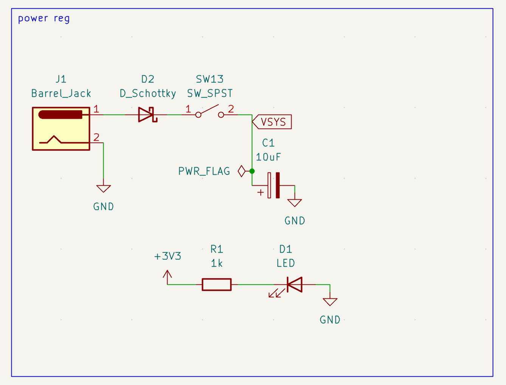
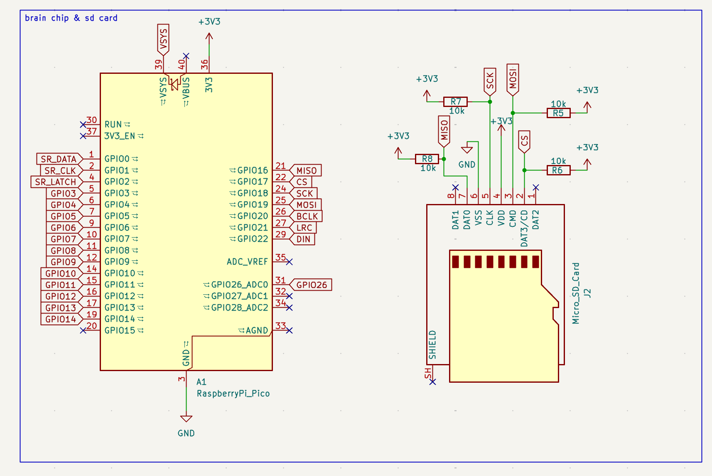
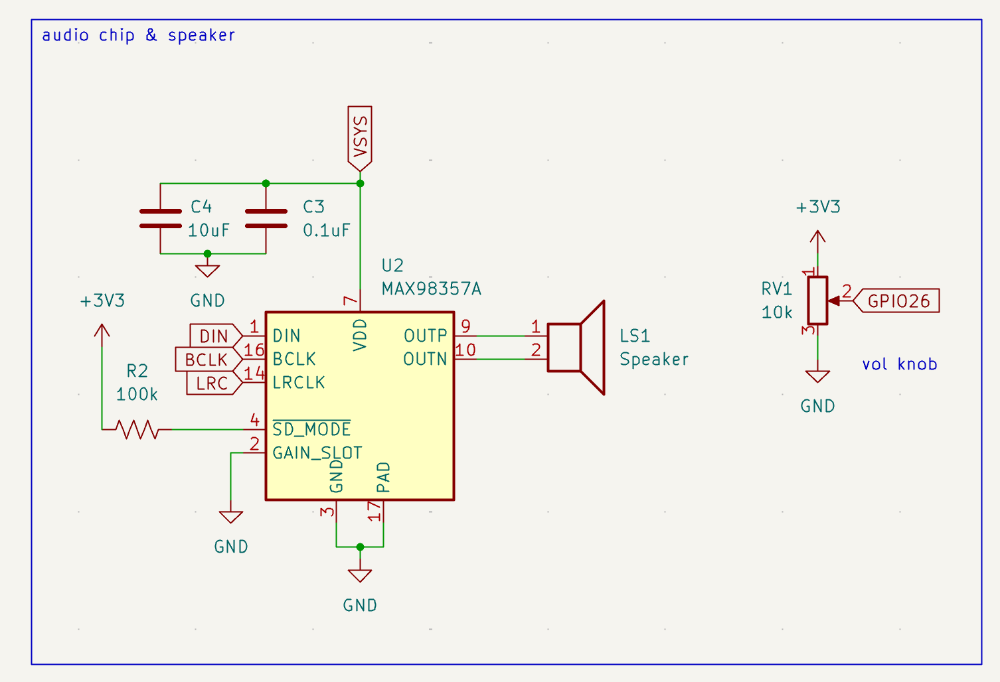
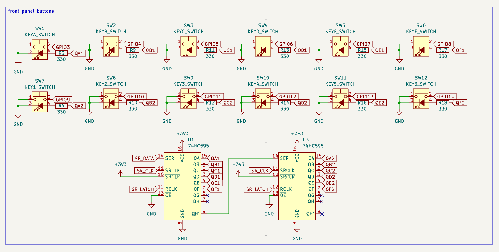

# Journal

Date: 09/27/2026
Today I started working on a tabletop jukebox. It features barrel jack input with the Raspberry Pi Pico as a 3v3 regulator, 12 light up keys to select songs from a microSD card, as well as the MAX98357A amp in mono setup.

